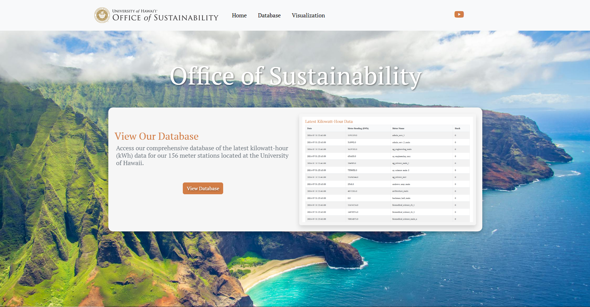

# Sustainability_Website
Website for the Office of Sustainability that integrates PostgreSQL kilowatt-hour data.

## How to Launch Website
In the terminal, type
```
cd C:\Users\Admin\Documents\GitHub\Sustainability_Website
```
and then
```
py app.py
```
In your browser, go to
```
http://localhost:5000/
```

## How to Launch Grafana
In the terminal, type
```
cd C:\Program Files\GrafanaLabs\grafana\bin
```
and then
```
grafana-server.exe
```
In your browser, go to
```
http://localhost:8081/
```

**Note: The Database page will not load without a PostgreSQL connection.**
